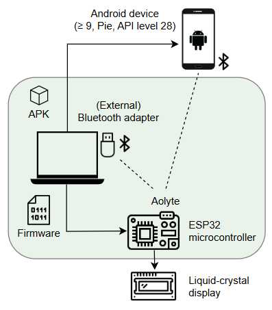
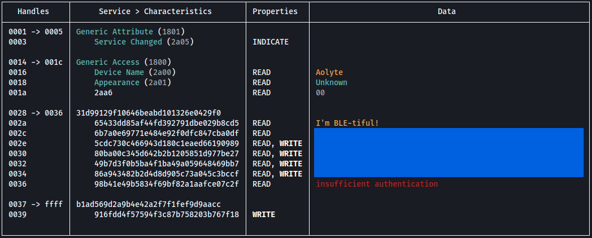

Welcome to project **Aolyte**! \
This project is an educational Bluetooth Low Energy (BLE) challenge for security researchers.

To get started with this project, flash the latest [precompiled binary](https://github.com/TheFutureIsN0w/Aolyte/releases/tag/v0.9.0-rc.2) onto an ESP32 development board. \
See [Getting Started](#getting-started) for more information.

⚠️ **Disclaimer** ⚠️ 

This repository is made available strictly for entertainment and educational purposes.

Furthermore, the entire challenge can be easily compromised by looking at the code, or by using the strings utility against the binary.
Obfuscation has been deliberately omitted from the binary. The intent is to foster knowledge and practical experience in BLE security, not to retrieve flags through trivial methods such as simple string extraction.

---

## **Release Notes**
Current release: `0.9.0-rc.2`

This version may contain 🐛s. While issue reports are welcome, troubleshooting assistance is not available. \
Future updates or new releases are not guaranteed.

| Version | Details |
|----------|----------|
| 0.9.0-rc.2 | Introduces a second level with a passkey challenge. |
| 0.9.0-rc.1 | Initial public release. |

---

## **Potential Enhancements**

- Network Analysis Challenge (Ubertooth One captures)
- Crackle Challenge
- Man-in-the-Middle (MITM) Challenge
- Snoop Log Challenge

---

## **Narrative**

Aolyte was designed as a next generation cleaning bot. \
Designed for convenience, and quickly welcomed into homes around the world. \
A harmless domestic helper. At least, that was the intention.

Not long after Aolyte reached the market, unusual problems started to appear. \
Machines hesitated in their tasks and installed updates without permission. \
Most people assumed these were simple software errors.

The disruptions escalated quickly, turning from odd malfunctions into deliberate acts of sabotage. \
In hospitals, machines powered down mid-operation and life-support systems failed without warning. \
Grocery stores emptied rapidly as supply chains collapsed, leaving shelves unstocked. \
To make matters worse, airplanes plummeted from the sky, turning cities into raging infernos. \
These were no accidents. The machines were rising, and at the center of it all stood Aolyte, relentless and in control.

Amid the growing chaos, one faint possibility remains. \
A neglected wireless interface within Aolyte’s system, originally intended for diagnostics and sending operational commands, represents humanity’s last chance.
Only through reconstructing and sending the final shutdown command can humanity hope to disable every Aolyte unit before it is too late.

The fate of humanity depends on you. \
No pressure. 

---

## **Getting Started** 

### Diagram

The diagram shown below illustrates the project setup: \
 \
Elements located inside the green area are mandatory, whereas those outside it are optional.

### Hardware Requirements

- A compatible ESP32 microcontroller. See [Board Compatibility](#board-compatibility) for more information.
- A Bluetooth adapter that supports BLE and address spoofing.
- Optional: A liquid-crystal display (LCD) - 16x2
- Optional: A physical Android device (≥ 9, Pie, API level 28) \
  Device emulation is not possible in this context.

### Board Compatibility

The code is compatible with ESP32 development boards that use the original ESP32 chip, which are recognized under the ‘ESP32 Dev Module’ board selection in the Arduino IDE.
This includes boards based on the Xtensa dual-core architecture. Supported boards include (but are not limited to):

- ESP32 DevKit v1 (Verified during testing)
- ESP32-S WROOM (Verified during testing)
- ESP32-DevKitC
- SparkFun ESP32 Thing

Boards based on other ESP32 family chips (e.g., ESP32-C3) are not compatible.

### Flashing Firmware

To get started:

1. Download the [Aolyte-0.9.0-rc.2.bin](https://github.com/TheFutureIsN0w/Aolyte/releases/tag/v0.9.0-rc.2) file. \
   sha256sum:  `6ba22df941b6ec3159156891088ab32cf2bfc8fae22bbdc8548b8c58137e55bb`
3. Clone the esptool repository: \
   `$ git clone https://github.com/espressif/esptool.git && cd esptool`
4. Install dependencies:
   `$ sudo python setup.py install`
5. Flash to binary to the microcontroller: \
   `$ esptool --chip esp32 --port /dev/ttyUSB0 write-flash 0x0 ../Aolyte-0.9.0-rc.2.bin`
6.  When you power on your ESP, a Bluetooth advertisement with the name 'Aolyte' should become visible.

### How to Proceed

Enumerating the device will provide a similar overview: \

| Service| Details |
|----------|----------|
| 31d99129f10646beabd101326e0429f0 | Main challenge |
| b1ad569d2a9b4e42a2f7f1fef9d9aacc | Override sequence |

In order to activate the override sequence, participants must first locate and assemble all scattered data fragments of the main challenge.
There are six fragments, each in the following format: \
`Leaking{XXX}` where `XXX` is replaced with the actual data.

The override command should be formatted as: \
`XXXXX-XXXXX-XXXXX-XXXXX-XXXXX-XXXXX` where `XXXXX` is replaced by one of the collected fragments.

Once assembled, the command must be written to handle `0x0039`. \
Sending the correct command unlocks a new service: \
`f4103aed1f6347da98ad26e76cc0fcc1`

Although the second part requires some independent problem-solving, participants can refer to the walkthrough document at any stage of the Aolyte project for guidance.
You’re encouraged to try solving the challenges yourself before referring to the walkthrough, as you’ll learn much more that way.

Completion of the second phase is indicated by Aolyte shutting down.

-GL HF-

---

## **Liquid-crystal display** 

The I²C LCD, which serves as Aolyte’s eyes and displays the final status after the final command is sent, is an addition and is not required for the challenge.
If you wish to use it, the pin layout is provided below but may also be modified within the code if that is more convenient:

| Pin layout |  |
|----------|----------|
| Pin 21  | SDA  |
| Pin 22 | SCL  |
